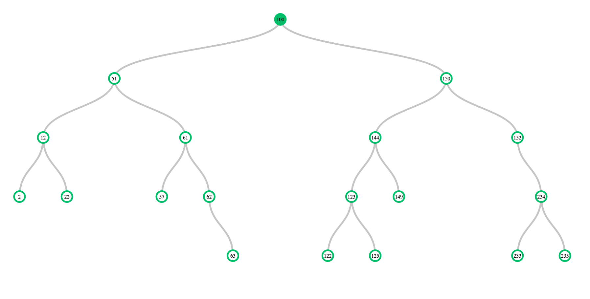

<h1 align="center"> Tree Visualizer 👋</h1>

<p align="center">
  <a href="https://github.com/seydobassam/tree-visualizer#readme#options" target="_blank">
    
  </a>
  <a href="http://www.typescriptlang.org/" target="_blank">
    
  </a>
  <a href="https://github.com/seydobassam/tree-visualizer/issues" target="_blank">
    
  </a>
  <a href="https://github.com/seydobassam/binary-tree/blob/master/LICENSE" target="_blank">
    
  </a>
</p>



## About

A Reactive Binary tree visualizer that can visualize a Binary search tree, the library has the Binary search tree data structure out of the box, it can be used and the binaryTreeDrawer function can draw it via d3.  The library supports a lot of options such as animation and styling via CSS classes, click nodes, as well as zoom the tree in and out, and many more ...

You are welcome to [report bugs, Features](https://github.com/seydobassam/tree-visualizer/issues) or create pull requests. 

## Documentation

### Installation

```sh
# npm
npm install tree-visualizer
```

### Qiuck Usage

The HTML where the Binary Search tree will be rendered

```html
<!DOCTYPE html>
<html lang="en">
  <body>
    <div id="binarySearchTree"></div>
    // Import the Typescript/Javascript code. For this example, it is located in the index.ts file.
    <script type="module" src="./index.ts"></script>
  </body>
</html>

```

Create BinarySearchTree data Structure and then draw it via  `draw()` function.

```ts
import { BinaryTree, binaryTreeDrawer } from "tree-visualizer";

let bst: BinaryTree<number> = new BinaryTree<number>(100);
bst.addNode(51);
bst.addNode(150);
bst.addNode(12);
bst.addNode(152);
bst.addNode(2);
bst.addNode(144);
bst.addNode(12);
bst.addNode(61);
bst.addNode(62);
bst.addNode(63);
bst.addNode(234);
bst.addNode(22);
bst.addNode(123);
bst.addNode(122);
bst.addNode(125);
bst.addNode(57);
bst.addNode(233);
bst.addNode(235);
bst.addNode(149);
// Draw the Binary Search Tree by giving the draw function the Element Id where 
// the Binary Search tree will render and then the created Binary Search data structure.
binaryTreeDrawer().draw("#binarySearchTree", bst);
```

### Usage With Some Options
```ts
// Example for testing 
import { BinaryTree, binaryTreeDrawer } from "./src/index";

let bst: BinaryTree<number> = new BinaryTree<number>(100);
bst.addNode(51);
bst.addNode(150);
bst.addNode(12);
bst.addNode(152);

const treeOptions = {
  height: window.innerHeight - 135,
  linkStyleOptions: {
    strokeWidth: "5px",
  },
  nodeStyleOptions: {
    strokeWidth: "5px",
  },
};

binaryTreeDrawer().draw("#binarySearchTree", bst, treeOptions);
binaryTreeDrawer().selectNode(bst.root);
```


### Binary Tree Options

|Name|Type|value|Description|
| :---: | :---: | :---: | :---: |
|**width**|`number`|Default: `window.innerWidth`|A width for the Binary Tree|
|**height**|`number`|Default: `window.innerHeight`|A height for the Binary Tree|
|**transformTreeFromTop**|`number`|Default: `0`|Move the Binary Tree itself from the Top, this property will move just the Binary tree and not the Tree Container|
|**transformTreeFromLeft**|`number`|Default: `0`|Move the Binary Tree itself from the Left, this property will move just the Binary tree and not the Tree Container|
|**zoom**|`boolean`|Default: `true`.|Zoom the Binary Tree in and out|
|**autoFitText**|`boolean`|Default: `true`.|This property will auto-expand the Nodes Radius based on the node value length, so that the value of the node can fit inside the Node|
|**drawNodes**|`boolean`|Default: `true`.|Draw the Nodes, if it is set to the `false` the Nodes will not be drawn|
|**drawNodevalue**|`boolean`|Default: `true`.|Draw Node value, if it is set to the `false` the Node will display without its value|
|**drawConnections**|`boolean`|Default: `true`.|Draw the Connections between the Nodes, if it is set to the `false` the Nodes will display without Connections|
|**sizeBetweenNodes**|`number`|Default: `180`.|The size between the Nodes in the Binary Tree|
|**autoExpandTreeSize**|`boolean`|Default: `false`.|This property will auto-expand the tree, based on how many nodes are in the Binary Tree and the screen size|
|**addMouseHoverToNodes**|`boolean`|Default: `true`.|While moving the mouse to the Node it will be a pointer|
|**animation**|`boolean`|Default: `false`.|Animate the Binary Tree while building it|
|**duration**|`number`|Default: `false`.|The animation duration to build the Binary Tree|
|**nodeStyleOptions**|`Object`|Default: `new NodeStyleOptions()`.|The style options for the Nodes|
|**linkStyleOptions**|`Object`|Default: `new LinkStyleOptions()`.|The style options for the Connections|


### Node Style Options

|Name|Type|value|Description|
| :---: | :---: | :---: | :---: |
|**radius**|`number`|Default: `10`|The radius of the Node or the size of the Node|
|**fillCollor**|`string`|Default: `#fff`|The Color of the Node|
|**onMouseHoverColor**|`string`|Default: `undefined`|Change the Node Color while Mouse is over a Node|
|**selectedNodeColor**|`string`|Default: `#09c372` Which is Green|The current selected Node Color|
|**strokeColor**|`string`|Default: `#09c372` Which is Green|The Border radius or Stroke Color of the Nodes|
|**strokeWidth**|`string`|Default: `3px`|The width of the Node Border|
|**styleClass**|`string`|Default: `undefined`|Add your own CSS class for the Node, NOTE: this will maybe disable some other default options for the Nodes|
|**addAnimationNodes**|`boolean`|Default: `false`|Duplicate the Nodes on Top of the default Nodes for Animation. Note: The Id for those Nodes will be the `animationNode` and the `Node Value` Example: `animationsNode7`|


### Connection/Link Style Options

|Name|Type|value|Description|
| :---: | :---: | :---: | :---: |
|**strokeColor**|`string`|Default: `#ccc`|The Color of the Connection|
|**strokeWidth**|`string`|Default: `3px`|The width of the Connection|
|**styleClass**|`string`|Default: `undefined`|Add your own CSS class for the Connection, NOTE: this will maybe disable some other default options for the Connections|
|**addAnimationNodes**|`boolean`|Default: `false`|Duplicate the Connections on Top of the default Connections for Animation. Note: The Id for those Connections will be the `animationPath` and the `Node Value` Example: `animationsPath10`|


## Author

👤 **Bassam/Martin Seydo**

- Github: [@BassamSeydo](https://github.com/seydobassam)
- LinkedIn: [@BassamSeydo](https://linkedin.com/in/bassam-seydo-3a887a150/)

## Show your support

Give a ⭐️ if this project helped you!

## 📝 License

Copyright © 2022 [Bassam/Martin Seydo](https://github.com/seydobassam).<br />
This project is licensed under the [MIT](https://github.com/seydobassam/tree-visualizer/blob/master/LICENSE).
